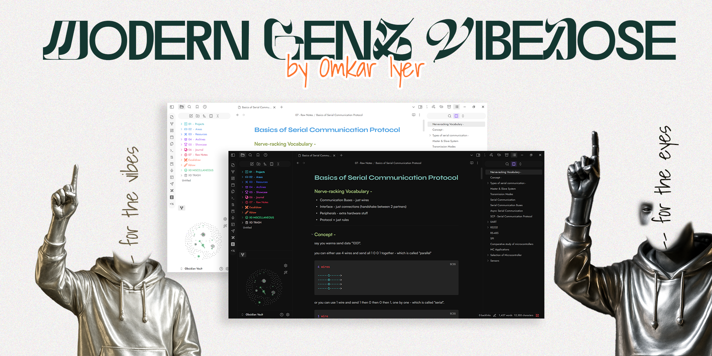

 

# ~(￣ ▽ ￣)~ **Modern GenZ Vibedose – Obsidian Theme**

Yo, first join out discord XD : here - [CLick me to JOIN Discord Server](https://discord.gg/NE5THYBfjn)

Modern GenZ Vibedose is a curated [Obsidian](https://obsidian.md/) desktop theme built for you guys who want a clean, modern yet expressive environment for thinking and writing.

Designed with **Live Preview** in mind, it brings a playful but professional vibe—perfect for students, writers, and digital thinkers.

⭐ **IMPORTANT** : Please go through the [External Snippets](#external-snippets) section for instructions on how to apply folder coloring snippets. It has to be done manually as of now.

 

## Index

-   [License](#license)
-   [Discord Community Joining Link](#discord-community)
-   [Discussions Panel](#discussions-panel)
-   [Credits](#credits)
-   [External Snippets](#external-snippets)
-   [Recommended Community Plugins](#recommended-community-plugins)

 

## License

<@\_@>
Licensed under **AGPL-3.0**  
Strictly built for Open-source. **Use, modify, and share freely** — **but** you must also open-source any derivative or hosted usage. Closed source usage is NOT allowed.

 

## Discord Community

We're gonna be improving this consistently, not just the theme, but we'll build a proper kit of toolkits (snippets, plugins, addon software-tools) around the theme & obsidian in general all open-sourced for us all, and will love for you to be a part of our community.
Right Now, am working alone, but will love for you to contribute.

[CLick me to JOIN Discord Server](https://discord.gg/NE5THYBfjn)

#### >>> Discord Perks :

-   exclusive mentions
-   early access to beta releases
-   interact 2-way with community in chat channel and VCs (voice & video calls)
-   ofc make new friends

 

## Discussions Panel

-   Also checkou **GitHub Discussions** to share direct feedback, ask questions, and suggest features.
-   Stay updated on announcements and collaborate to make the theme better together.

 

## Credits

### External Snippets

Original - Colored Sidebar Snippet: https://github.com/CyanVoxel/Obsidian...
(I used a modified version of above snippet - check snippets folder)

- Grab the snippet "Sidebar Folders Gradient Coloring.css" file from my github here : https://github.com/omkar-4/Modern-GenZ-Vibedose/blob/main/snippets/Sidebar%20Folders%20Gradient%20Coloring.css

- 1. To apply snippets - download and copy snippet "Sidebar Folders Gradient Coloring.css" file from snippets/ folder within my repo and goto `\.obsidian\snippets` location inside your vault folder and paste it.

- 2. Then in Obsidian -> settings -> Appearance (scroll-down) -> CSS snippets -> click refresh 🔃 button -> enable "Sidebar Folders Gradient Coloring".

 

## Recommended Community Plugins

1. Excalidraw / Tldraw
2. Latex Suite
3. Iconize
4. Templater
5. Recent Files

 

Made with 💖 by [Omkar](https://github.com/omkar-4)
